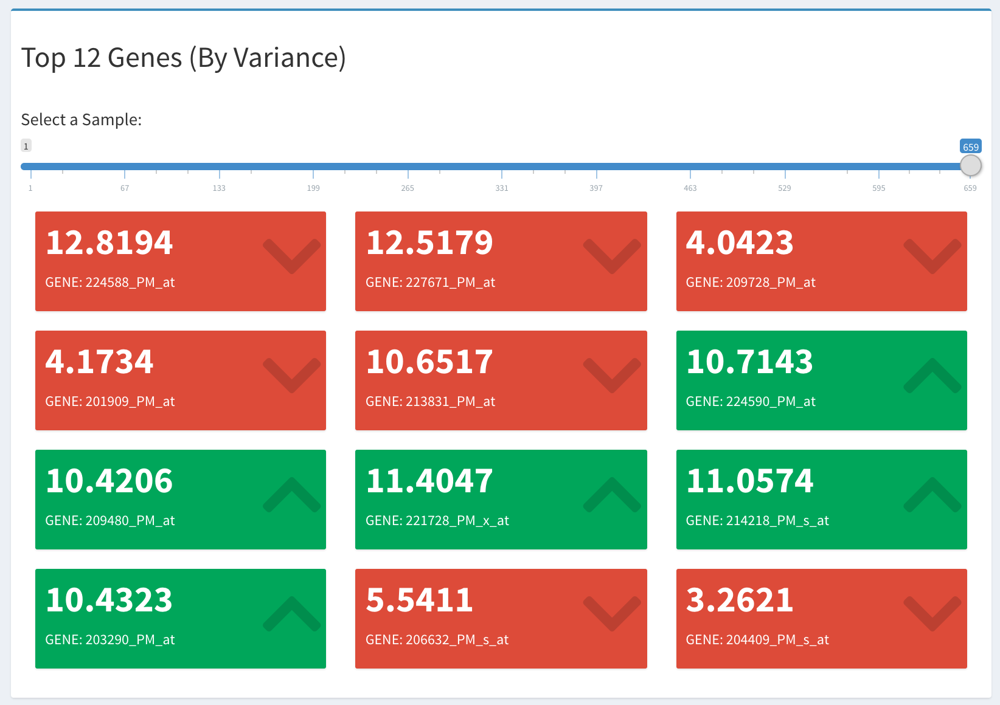
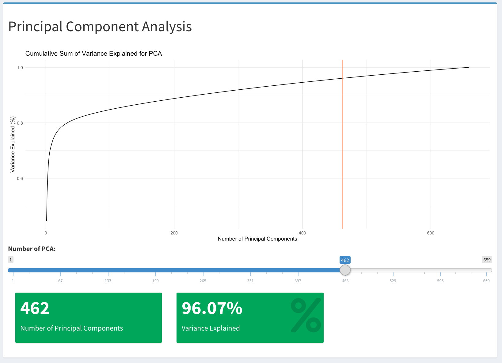
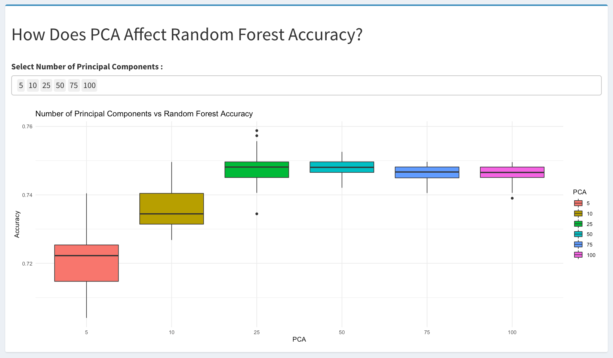

# Topic

As the technology for sequencing genes becomes more readily available, more powerful and cheaper, the information about genes that is captured becomes more detailed. This becomes a problem when using machine learning techniques to analyse the high dimensional data. This problem is known as the "big p, little n" problem where p refers to the number of measurements and n refers to the subjects. Consequences of high dimension data include multiple hypothesis testing and high computation time. In this report, we analyse the GSE107509 gene expression data set that contains 659 samples and over 54,000 genes. This data set was chosen since due tot he high number of samples leading to a higher diversity of samples.

Dimension reduction techniques such as Principal Component Analysis (PCA) is a way to transform the high dimension data into low dimension data while attempting to preserve the original information as much as possible. PCA is used to help alleviate the problems associated with "big p, little n".

The topic that is addressed in this report is to analyse how dimension reduction techniques such as PCA affect the accuracy of random forest models. An accompanying Shiny App was developed to provide a way to interactively visualise the effect of how PCA (Principal Component Analysis) affects the accuracy of a random forest model on gene expression. 


# Approach

The approach to answering the question uses Principal Component Analysis to reduce the number of dimensions in the data, Random Forests to predict the outcome and cross validation to predict the accuracy of the models. The approach includes preselecting a number of principal components since it was not feasible to run in real time. Random Forest models were trained using the reduced number of principal components and cross validation was used with boxplots to show the the effect of how the number of principal components affects the accuracy of the Random Forest model.

# Shortcomings

A shortcoming to the data analytics was the size of the data which had an effect on how the data was stored on Github (There is a 100MB limit on Github). To host the Shiny application on Github, the gene expression data was split into several parts and recombined in the Shiny app when it is run. 

Another shortcoming was the computation time for running PCA and Random Forest. To address this issue, the data was preprocessed and saved. Some of the data used in the Shiny app uses preprocessed data to reduce the time it takes to run models. This does prevents the user in having full control over the parameters but a selection of preprocessed values is provided for comparison.


# Graphics

There are 3 sections to the Shiny App. The sections include Calculator, PCA and Random Forest. 

The first section makes use of colour to visualise the top 12 genes (measured by the highest variance) and visualises how an individuals gene expression compares with the mean in the data set (Fig. 1). Red indicates the individual had a gene expression lower than the mean while green indicates the individual had a gene expression higher than the mean for that particular gene.




The second section makes use of a screeplot of the PCA to show the cululative variance explained by the number of Principal Components selected (Fig. 2). The user can specify the number of Principal Components by a slider which dynamically shows the percentage of variance explained by the specified number of Principal Components.



The third section makes use of boxplots to show how the number of Principal Components affects the accuracy of a Random Forest model (Fig. 3). The user can compare between 5, 10 25, 50, 75, 100, 150 and 200 components using a selection box which dynamically updates the boxplots.



The Github link to the Shiny App is provided below: 

[Github Link](https://github.com/iRick92/DATA3888_Discipline_Project_2)


The Shiny App can be accessed by the running the following line of code in R:

```{r, eval = F}

runGitHub("DATA3888_Discipline_Project_2_Shiny", "iRick92")

```


# 750 WORDS!!!

## Executive Summary

1. Provide a clear statement of the question you intend to address or the topic that you intend to focus on your multi-media discipline report. 


2. What is your approach to addressing the question stated in (1) and what is the key technique in your approach (e.g. random forest, lasso, Bayesian network etc.)? Select ONE method and provide a concise technical description.

3. Identify potential shortcomings or issues associated with the data analytics that you have performed and discuss a possible approach to address the issue. Here, a strategy doesn't necessarily refer to a model, but it must address the issue.


4. Create and describe the interactive graphics (or shiny app) that illustrate one aspect of your report, and please provide the link to the shiny app (this can either be a web page or a GitHub link). 
